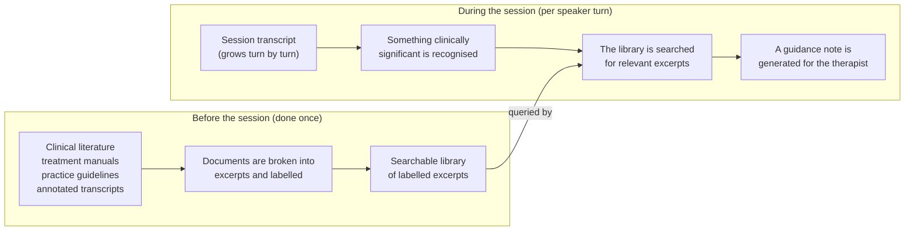
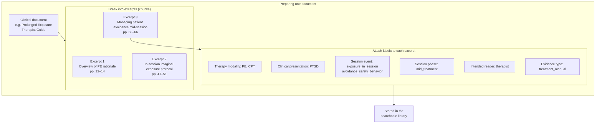
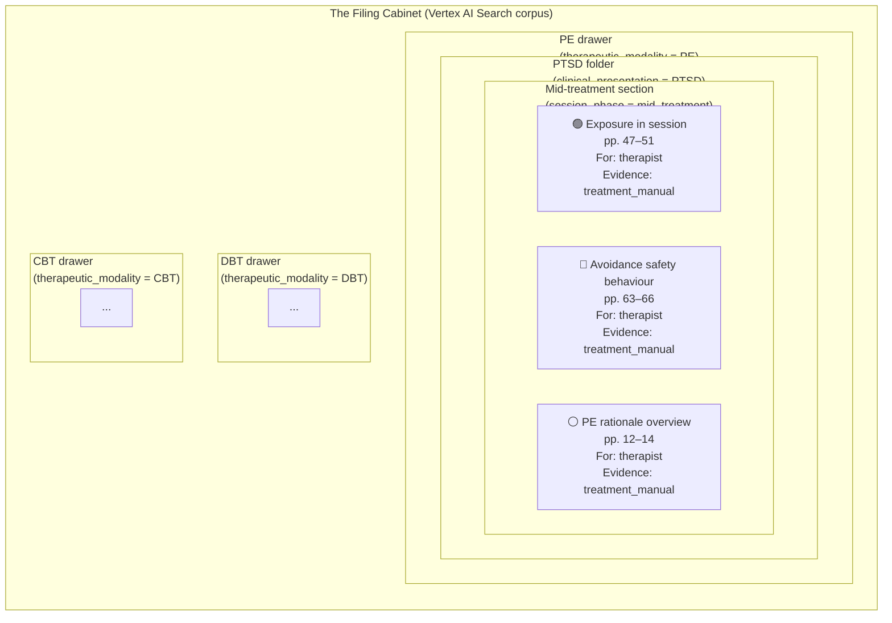
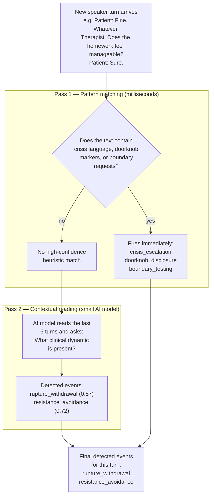
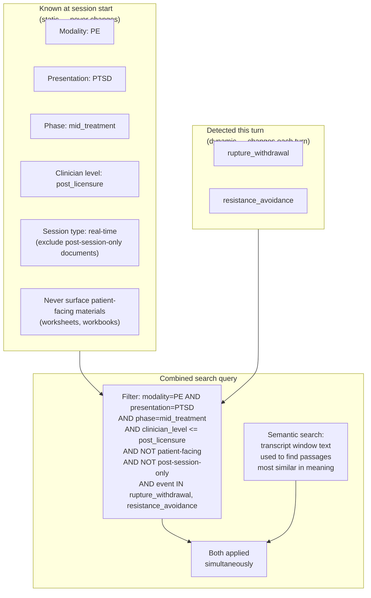
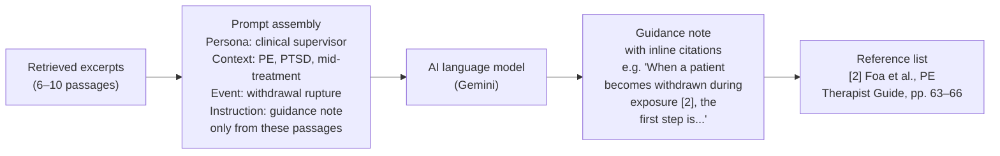
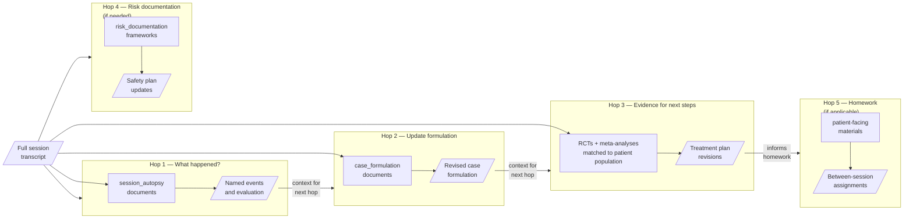
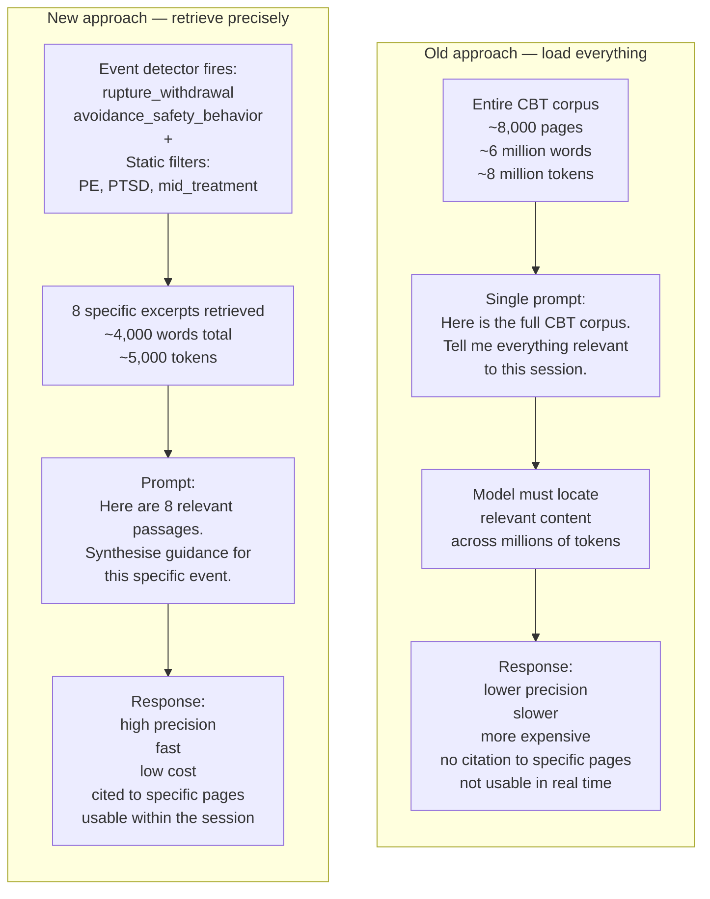
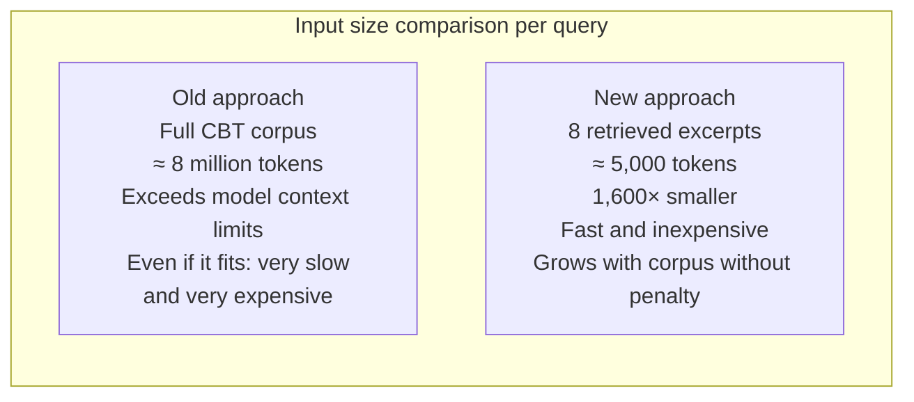

# How the System Finds the Right Guidance at the Right Moment

This document explains how the real-time analysis (RTA) and after-session analysis (ASA) systems work — from how documents are prepared before a session, to how the right passage surfaces at the moment a therapist needs it.

---

## The Big Picture

Imagine a highly experienced clinical supervisor sitting just outside the therapy room. They have spent years reading every major treatment manual, annotated session transcript, and clinical practice guideline in the field. When something clinically significant happens in the session — a rupture, a crisis disclosure, a patient's sudden shutdown — the supervisor immediately knows which chapter of which book is relevant, retrieves it from memory, and delivers a concise note to the therapist.

This system is the automated version of that supervisor. It listens to the session transcript, recognises clinical events as they occur, and retrieves relevant guidance from a carefully prepared library of clinical literature — in time to be useful within the session.

The three steps are:

1. **Prepare the library** — before any session, clinical documents are broken into excerpts and labelled so they can be found quickly later
2. **Recognise what is happening** — during the session, the system identifies clinical events as they emerge in the transcript
3. **Find and deliver guidance** — the recognised event drives a targeted search of the library; the best matching excerpts are assembled into a concise response



The rest of this document explains each step in detail.

---

## Step 1 — Preparing the Library (Ingestion and Metadata Tagging)

### Cutting books into index cards

A clinical treatment manual might be 300 pages long. If the whole book were retrieved every time the system searched for something, the response would be overwhelming and slow — most of it would be irrelevant to what is happening right now.

Instead, every document in the corpus is cut into small excerpts, each roughly the length of a few paragraphs. Think of this as photocopying every page of every book and then sorting the individual pages into a filing system.

Each excerpt is called a **chunk**. A chunk is the smallest unit the system retrieves and reads.

### Attaching labels to each excerpt

A photocopied page sitting loose in a filing cabinet is useless unless it is labelled. So after each chunk is created, an AI model reads it and attaches a set of labels — one for the therapy modality it addresses, one for the clinical presentation it applies to, one for the type of in-session event it discusses, and several others.

These labels are called **metadata**. Metadata is information *about* the content rather than the content itself — it describes the excerpt without reproducing it. Just as a library card catalogue entry tells you a book's subject, author, and location without containing the book's text, metadata tells the search system where a chunk fits in the clinical landscape.



The labels used across all documents are standardised — every excerpt is labelled using the same controlled list of terms. This means the system can say precisely *"find me all excerpts about rupture repair in DBT sessions in mid-treatment"* without any ambiguity.

### The filing cabinet analogy in full

Imagine a very large filing cabinet with many dimensions simultaneously:

- One set of drawers is organised by **therapy modality**: one drawer for CBT, one for DBT, one for PE, one for EFT, and so on
- Each drawer is further divided by **clinical presentation**: folders for PTSD, depression, BPD, OCD, etc.
- Each folder is colour-coded by **the type of session event it addresses**: red tabs for rupture events, blue tabs for crisis escalation, green tabs for exposure work, and so on
- Each sheet inside a folder carries a corner stamp indicating **who it is written for** (clinician or patient) and **how strong the evidence is** (RCT-based, expert consensus, illustrative vignette)

When the system needs to find guidance for a therapist conducting PE with a PTSD patient who is avoiding the exposure exercise, it opens the PE drawer, finds the PTSD folder, pulls the sheets with avoidance tab labels, and checks that they are stamped for clinician use. The result is a small, precisely targeted stack of excerpts — not the whole filing cabinet.



---

## Step 2 — Recognising What Is Happening (Event Detection)

### The supervisor who listens for clinical signals

During a session, the system receives the transcript turn by turn. After each new speaker turn, it reads the most recent exchange and asks: *"Is something clinically significant happening here?"*

This question is answered by the **event detector** — the component that classifies what kind of in-session event is unfolding.

The event detector works in two passes, from fast to careful:

**Pass 1 — Pattern matching (immediate, no AI call)**

Certain events announce themselves with recognisable language. "I want to kill myself" signals a crisis. A patient saying "oh, one more thing before I go" signals a doorknob disclosure. The system checks for these patterns first using simple text matching — no AI model is involved, so the check takes milliseconds.

**Pass 2 — Contextual reading (slightly slower, uses a small AI model)**

More subtle events — a patient gradually going quiet and giving one-word answers (withdrawal rupture), a patient expressing frustration with the therapist's approach (confrontation rupture), a patient intellectualising to avoid emotional contact — require reading the texture of the exchange, not just surface language. A small AI model reads the recent turns and classifies the clinical dynamic.



The output is a list of **event tags** — labels from the same controlled vocabulary used to tag the documents during preparation. This is the critical connection: the filing cabinet was organised using these terms, and the event detector produces these terms. The labels on the documents and the labels the detector produces are the same language.

---

## Step 3 — Finding and Delivering Guidance (Retrieval and Generation)

### Two kinds of filtering: what we always know vs. what just happened

When the system searches the library, it uses two types of constraints simultaneously:

**Static constraints** — known before the session starts, from the patient record. These never change during the session:

- *Which therapy modality is this session using?* (e.g., PE — so only retrieve PE-relevant documents)
- *What is the patient's clinical presentation?* (e.g., PTSD — so only retrieve PTSD-relevant documents)
- *What phase of treatment is this?* (e.g., mid-treatment)
- *What is the clinician's training level?* (e.g., post-licensure — so do not surface specialist-certification-required guidance)
- *Is this a real-time session or a post-session review?* (affects which documents are accessible)

**Dynamic constraints** — determined by the event detector in the current turn:

- *What session event just occurred?* (e.g., rupture_withdrawal — so retrieve rupture-specific guidance)

Together these constraints are translated into a single precise query to the filing cabinet.



### The search itself

Think of the search as two things happening at the same time:

1. **The filter check** — like telling a librarian which section of the filing cabinet to open. Only documents matching all the static and dynamic constraints are even considered.

2. **The similarity match** — within the filtered documents, the system ranks excerpts by how closely they match the actual transcript window as text. This uses a form of AI that understands meaning rather than just keywords — "patient went silent and gave single-word answers" will match excerpts about withdrawal rupture even if those words are not in the excerpt.

The result is a short ranked list — typically 6–10 excerpts — of the most relevant clinical guidance passages for this exact moment in this exact session.

### Turning excerpts into guidance

The retrieved excerpts are not sent directly to the therapist. Instead, they are handed to an AI language model (the same kind of model as ChatGPT, but confined to responding only from the provided excerpts) along with a prompt that says, in effect:

> *"You are an experienced clinical supervisor. A session is in progress. The therapist is practicing PE with a PTSD patient in mid-treatment. A withdrawal rupture has just occurred. Here are the relevant passages from the clinical literature. Write a concise guidance note the therapist can act on right now."*

The model synthesises the passages into a coherent, readable note. Each factual claim in the note is tagged with a citation number linking back to the specific excerpt and page it came from.



---

## A Worked Example End to End

**Scenario:** A therapist is conducting Prolonged Exposure therapy with a patient who has PTSD. It is session 7. The therapist asks the patient to begin the imaginal exposure. The patient responds with short, flat answers and stops engaging.

```mermaid
flowchart TD
    subgraph TRANSCRIPT["Transcript (session 7, minute 23)"]
        T1["Therapist: Let's begin the imaginal exposure now.\nI'd like you to close your eyes and describe the moment."]
        T2["Patient: Fine."]
        T3["Therapist: Take your time. Start wherever feels right."]
        T4["Patient: I don't know. It doesn't matter."]
        T5["Therapist: I notice you seem a bit distant. Is this feeling familiar?"]
        T6["Patient: Sure."]
    end

    subgraph DETECTION["Event detection"]
        H["Heuristic pass:\nno crisis language\nno doorknob marker"]
        LLM_D["AI model reads turns T1–T6:\nPatient is giving one-word answers\nafter exposure instruction\n→ rupture_withdrawal (0.91)\n→ avoidance_safety_behavior (0.78)"]
        H --> LLM_D
    end

    subgraph FILTERS["Search filters assembled"]
        SF["STATIC:\nmodality = PE\npresentation = PTSD\nphase = mid_treatment\nclinician = post_licensure\nnot patient-facing\nnot post-session-only"]
        DF["DYNAMIC:\nsession_event_tags IN\n  rupture_withdrawal\n  avoidance_safety_behavior"]
        SF --> COMBINED_F["Combined filter"]
        DF --> COMBINED_F
    end

    subgraph RETRIEVAL["Corpus retrieval"]
        COMBINED_F --> RESULTS["Top 8 passages returned:\n• PE guide pp.63–66: managing avoidance\n• Safran & Muran: rupture repair steps\n• PE guide pp.47–51: in-session exposure protocol\n• Eubanks et al.: withdrawal rupture markers\n• ..."]
    end

    subgraph GENERATION["Guidance generation"]
        RESULTS --> GUIDANCE["Guidance note to therapist:\n'The patient's shift to single-word responses\nfollowing the exposure instruction is consistent\nwith a withdrawal rupture [3]. Before resuming\nexposure, Foa et al. recommend pausing to\nacknowledge the shift directly [1]:\n\"I notice you seem to have pulled back.\nCan we check in about what just happened?\"\n\nIf the rupture is not addressed, resuming\nexposure risks reinforcing avoidance [1][3].'"]
    end

    TRANSCRIPT --> DETECTION
    DETECTION --> FILTERS
```

**What just happened, without the technical language:**

The system noticed the patient's flat, avoidant responses and recognised them as two distinct clinical patterns — a therapeutic rupture (the patient pulling away) and an avoidance behaviour (the patient using disengagement to sidestep the exposure task). It searched the clinical library for guidance specifically relevant to PE, PTSD, mid-treatment sessions, and those two patterns. It retrieved eight relevant excerpts, then a language model synthesised them into a practical note the therapist can act on within seconds.

---

## Why Metadata Makes This Possible

Without the labels, the system would have to read every document every time — which is not feasible at the scale of a clinical corpus and the speed required during a live session.

With the labels, a search that could theoretically match thousands of documents is immediately narrowed to the small set of documents that are relevant to *this modality, this presentation, this phase, and this event*. The result is faster retrieval and, more importantly, higher precision — the therapist receives guidance that is actually applicable to what is happening, not a generic overview.

The table below summarises what each category of label is doing:

| Label category | What it represents | What it enables |
|---|---|---|
| `therapeutic_modality` | Which therapy framework the excerpt addresses (CBT, DBT, PE, EFT, ...) | Prevents a DBT skills excerpt from appearing during a PE session |
| `clinical_presentation` | Which diagnostic theme the excerpt applies to (PTSD, BPD, OCD, ...) | Prevents PTSD guidance from surfacing for a patient with OCD as the primary presentation |
| `session_event_tags` | Which in-session clinical events the excerpt directly addresses | The primary real-time trigger — drives the dynamic filter |
| `session_phase` | Where in the treatment arc the excerpt is relevant (early, mid, late, termination) | Prevents late-treatment relapse-prevention content from appearing in session 3 |
| `target_audience` | Whether the excerpt was written for a therapist or a patient | Hard exclusion: patient-facing worksheets are never surfaced during the session |
| `training_level_required` | The minimum clinician training needed for the technique described | Prevents specialist-only interventions from being recommended to a trainee |
| `clinical_caution` | Explicit contraindications or precautions stated in the source | Surfaced alongside any technique recommendation — not buried in a footnote |
| `corpus_scope` | Whether the document is appropriate for real-time retrieval or post-session use only | Prevents research papers and patient homework from appearing during the live session |

---

## The After-Session System: More Depth, More Hops

The after-session analysis (ASA) system works on the same principles but with more time and more sources available.

Where the RTA system does a single targeted search per turn, the ASA system performs a sequence of searches — one for each question it needs to answer:

1. *What clinically significant events occurred?* → searches session autopsy documents
2. *How does this update the case formulation?* → searches case formulation frameworks
3. *What does the research evidence say about next steps for this patient?* → searches RCTs and meta-analyses, filtered to the patient's population
4. *What homework would be appropriate for next session?* → searches patient-facing materials (the only time these are retrieved)
5. *Was there anything requiring risk documentation?* → searches risk management frameworks
6. *Were any outcome instruments mentioned?* → searches interpretation guides for those specific instruments

Each search uses the previous search's output to make the query more informed. The autopsy of what happened in the session shapes what the evidence search asks. This sequential deepening — where one answer feeds the next question — is what allows the after-session report to build from a simple event log into a nuanced clinical synthesis.



---

## Summary

| What happens | How it works | The analogy |
|---|---|---|
| Documents prepared in advance | PDFs are cut into short excerpts; an AI model reads each excerpt and attaches labels | Photocopying a library's books and filing each page under multiple subject tabs |
| Labels are standardised | Every excerpt uses the same controlled vocabulary for its labels | All filing tabs across all cabinets use the same label-printing system |
| Session starts | The patient record supplies static labels that never change during the session | The librarian knows which section of the building to work from before you ask a question |
| An event occurs | The event detector reads the recent turns and identifies the clinical dynamic | A supervisor listening in the hall recognises the pattern of what is happening |
| The library is searched | Static + event labels are combined into a precise filter; semantic similarity ranks within the filtered set | The librarian goes to the right section, then reads the relevant pages to find the best match |
| Guidance is delivered | The retrieved excerpts are synthesised into a concise note by a language model | The supervisor reads the relevant pages, then dictates a concise note to pass under the door |
| Citations are attached | Each claim links back to the specific excerpt and page it came from | Every sentence in the supervisor's note has a page reference so you can verify it yourself |

---

## Why This Beats the Alternative: The "Load Everything" Approach

Before systems like this one existed, the typical approach to getting AI guidance from a clinical corpus was simpler and more brute-force: load the entire corpus for a given treatment modality into a single AI prompt, ask every question at once, and wait for one large response.

For example: *"Here are all 3,000 pages of the CBT corpus. A session is in progress. Tell me what is clinically significant, what the patient's formulation is, what the therapist should do next, and what homework to assign."*

This approach has intuitive appeal — it feels thorough, and it avoids the complexity of event detection, metadata labelling, and multi-hop retrieval. But it fails on every dimension that matters for clinical use. The problems are not minor inconveniences; they are fundamental structural limitations.

### The needle-in-a-haystack problem

When an AI model receives a very long document to read, it does not read it the way a human skims a chapter. It processes all of it with equal attention — and research has consistently shown that the longer the document, the harder it is for the model to locate and prioritise the relevant parts. Information buried in the middle of a very long input is systematically under-weighted compared to content near the beginning or end.

Loading the entire CBT corpus means the model must find the three paragraphs about rupture repair in the middle of thousands of pages about cognitive restructuring, behavioural activation, schema therapy, sleep hygiene, and dozens of other topics that are entirely irrelevant to the current moment. The result is guidance that is diluted, less precisely grounded, and sometimes wrong — not because the model is incapable, but because the task of finding the needle has been made unnecessarily hard.

The metadata-driven approach solves this before the model even sees any text. By the time the AI model receives its input, the filtering has already been done. It reads eight precisely selected excerpts, not 3,000 pages.



### The scale problem: it does not fit

A single major treatment modality corpus — CBT alone — spans dozens of foundational texts, annotated transcripts, practice guidelines, and clinical workbooks. Loaded in full, this represents tens of millions of words. Even the most capable AI models available today have a hard ceiling on how much text they can read in a single call (their "context window"). An entire modality corpus, let alone a multi-modality corpus, exceeds what any current model can process in one call.

The metadata approach sidesteps this ceiling entirely. Because only 6–10 excerpts are ever sent to the model, the input is always small, regardless of how large the underlying corpus grows. Adding 50 new clinical texts to the corpus does not slow down retrieval — it only improves it by providing more potential matches.



### The speed problem: real time means real time

A clinical session moves quickly. A therapist has seconds to absorb guidance and decide how to respond before the conversation moves on. A system that takes 30–60 seconds to process millions of tokens is not a real-time tool — it is an offline tool wearing a real-time costume.

The per-turn latency of the metadata approach is measured in seconds, not tens of seconds, because the AI model is only ever processing a small, pre-filtered input. The heavy work — labelling documents, building the index — was done once, before any session started.

### The precision problem: the wrong content drowns the right content

Imagine asking a clinical supervisor for help with a rupture occurring in a PE session, and having them respond by reading every PE textbook, every CBT manual, and every DBT skills guide simultaneously before answering. Most of what they read is irrelevant. The CBT thought records and the DBT diary cards and the motivational interviewing OARS framework do not help with a PE rupture — they just add noise that the supervisor must filter out mentally before they can give a useful answer.

This is exactly what the "load everything" approach asks the AI model to do. Every extra page of unrelated content reduces the proportion of the model's attention available for the relevant pages. The model's response becomes a blend of what is relevant and what happens to be statistically prominent in the bulk of the text — which for a CBT corpus would be CBT content, even if the session is primarily PE.

The metadata approach respects the specific event happening right now. The retrieval filter for a PE rupture returns PE rupture content — not CBT thought-challenging techniques, not DBT skills training, not psychoeducation from an ACT manual.

### The cost problem: paying for irrelevance

AI model API costs scale directly with the number of tokens processed. A single call that sends 8 million tokens costs roughly 1,600 times more than a call that sends 5,000 tokens. In a 50-minute session with a query issued every 30 seconds, the "load everything" approach would produce 100 API calls each processing 8 million tokens — a cost structure that makes real-time clinical deployment economically impossible at scale.

The metadata approach makes real-time deployment economically viable because the per-call cost is proportional to a small retrieved set, not to the size of the whole corpus.

### The mixing problem: the wrong documents for the wrong moment

The "load everything" approach has no concept of *when* a document is appropriate. A patient-facing homework worksheet, a post-session RCT about treatment outcomes, and a real-time rupture repair protocol are all loaded together. The model must somehow infer which content is appropriate for a live clinical exchange and which is not.

This is exactly the problem that `corpus_scope`, `target_audience`, and `analysis_function` metadata fields are designed to prevent. Patient-facing materials are hard-excluded from real-time retrieval. Post-session research papers are inaccessible during a live session. The routing is not left to the model's inference — it is enforced structurally before the model ever sees the input.

### The accountability problem: where did that come from?

When a model generates a response from 8 million tokens of undifferentiated text, tracing a specific claim back to a specific source page is impractical. The model may be drawing on anything in those millions of tokens — or it may be generating from training memory without grounding in any retrieved source at all.

In the metadata approach, there is no such ambiguity. Every retrieved excerpt carries its source file name, chapter, and page numbers. The citation builder links each claim in the generated response to the specific excerpt it came from. A clinician can verify any piece of guidance against the source text within seconds. This is not a nice-to-have — in a clinical context, the ability to trace AI-generated guidance to a citable primary source is a basic accountability requirement.

### Summary comparison

| Property | Load-everything approach | Metadata-driven RAG |
|---|---|---|
| Input size per query | Entire corpus (~millions of tokens) | 6–10 excerpts (~5,000 tokens) |
| Fits in model context window | No (for realistic corpus size) | Always |
| Per-query latency | 30–60+ seconds | 2–5 seconds |
| Per-query cost | Proportional to full corpus size | Proportional to retrieved set |
| Precision | Diluted by irrelevant content | High — only event-matched content |
| Modality isolation | None (all modalities mixed) | Enforced by static pre-filter |
| Patient-facing content excluded | No | Yes — hard structural exclusion |
| Post-session content excluded from live use | No | Yes — corpus_scope filter |
| Scales with corpus growth | Cost and latency grow with corpus | Cost and latency remain constant |
| Traceable citations | Impractical | Every claim linked to source page |
| Real-time clinical use | Not feasible | Designed for it |

The fundamental shift is one of philosophy: instead of asking the model to do the work of finding and filtering relevant content within a massive input, the metadata system does that work structurally — before the model is involved at all. The model's job becomes synthesis and communication, not retrieval. Each component does what it is best suited for: structured search for finding, language models for explaining.
