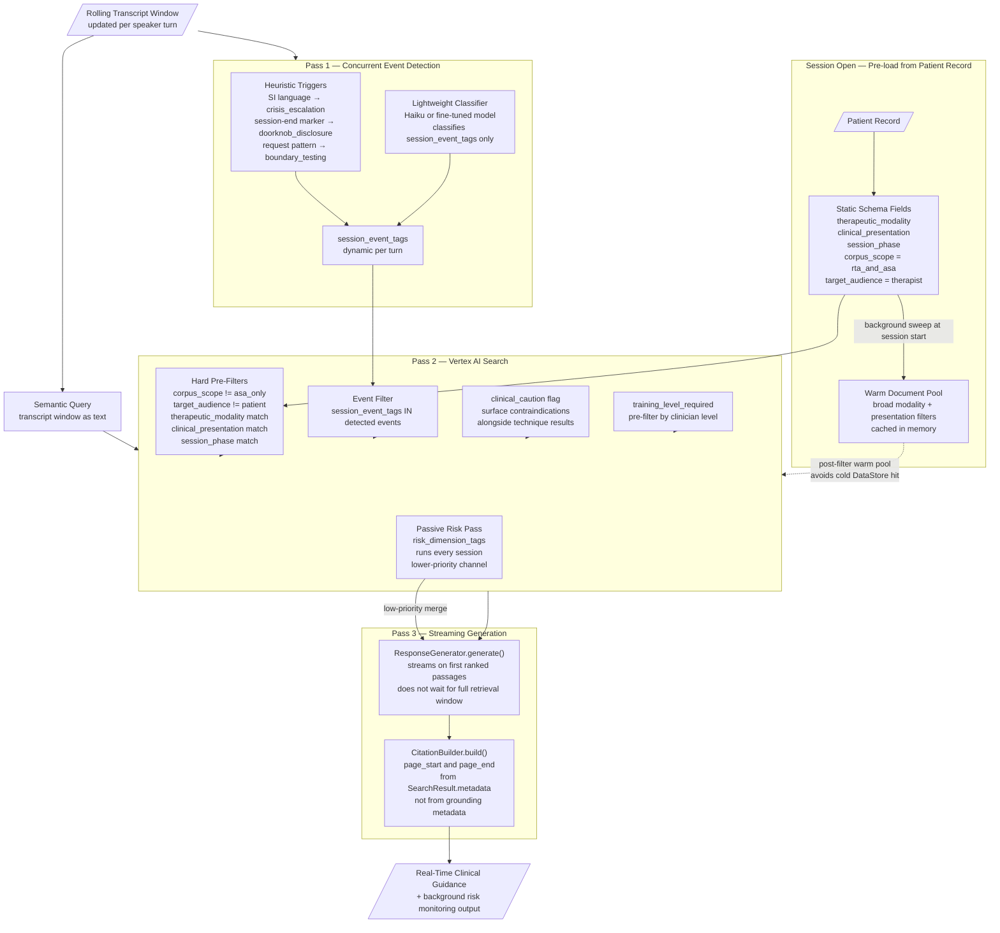
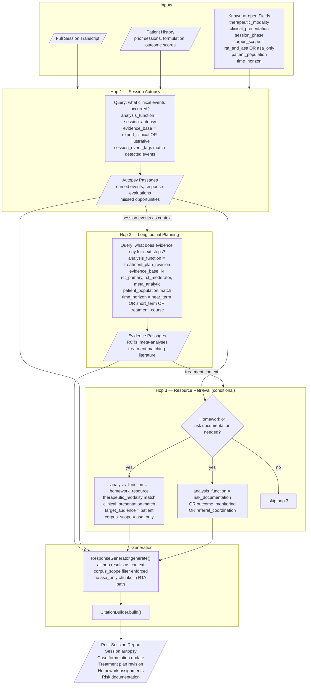
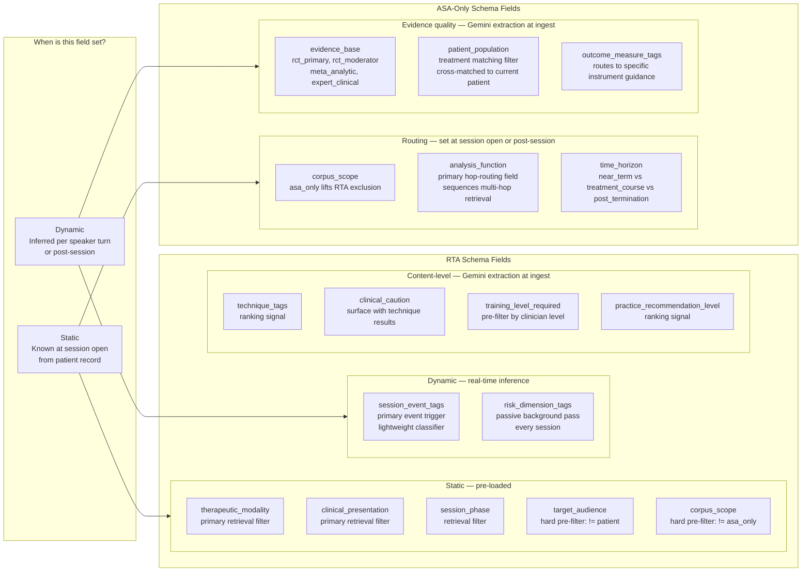
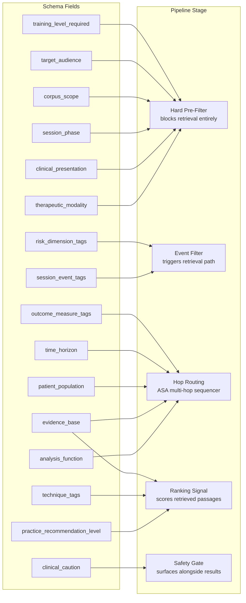

# RAG Pipeline Architecture — Mermaid Diagrams

---

## 1. RTA Pipeline (Real-Time Analysis)

The optimized 1.5-pass design: static metadata from the patient record eliminates the first LLM classification pass for all non-event fields. Only `session_event_tags` and `risk_dimension_tags` require real-time inference.

---

## 2. ASA Pipeline (After-Session Analysis)

Multi-hop retrieval is intentional here. Each hop is sequenced: the output of earlier hops is injected as context into later retrieval queries. Latency is not a binding constraint.

---

## 3. Schema Field Taxonomy

Which fields are set statically (from patient record before session), which require real-time inference, which are ASA-only additions, and how each field is used in retrieval.

---

## 4. Field-to-Stage Mapping (Quick Reference)

